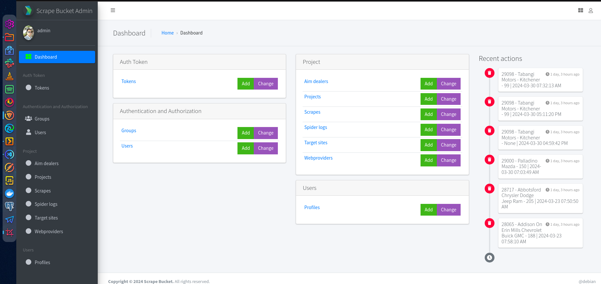
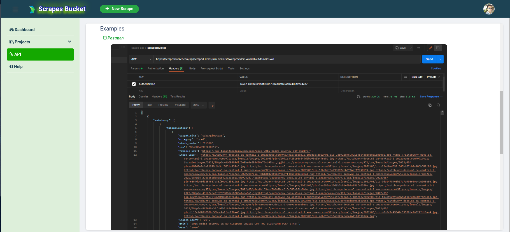

<h1 align="center"> WEBSCRAPING APP</h1>

### Stack: `python, django, scrapy, javascript, jquery, chartjs`

 

## ** SCRIPT TO RUN **

### Cron

- To manage and execute spider scheduling in parallel.
  

### Bash

- To execute all spiders manually. Run `xspider`
  

### Per site example

- To selectively target specific sites for a particular spider manually.  
  `scrapy crawl edealer -a url=https://www.stockiechrysler.com/`

### Per template/spider example

- To manually execute a spider or multiple spiders  
  `python runspider.py -s edealer`  
  `python runspider.py -s all`

 

## ** BACK END **

### Dashboard

### Target Sites

### Spider logs

 

## ** FRONT END **

### Dashboard

### Target Sites

### Target Site Info

### Target Site Scrapes

### Target Site Scrape Details

### API

### API - Postman Example

### API - Curl/Httpie Example

### Help

 

## ** ADDT'L NOTES **

I recorded an 8-minute screen capture video showcasing the app's initial deployment in April 2022 from the client's perspective.

[Screenshare link](https://drive.google.com/file/d/1y5J7UsepRDqGu0v0K8vlH_uiHZwExoZy/view?usp=sharing)
